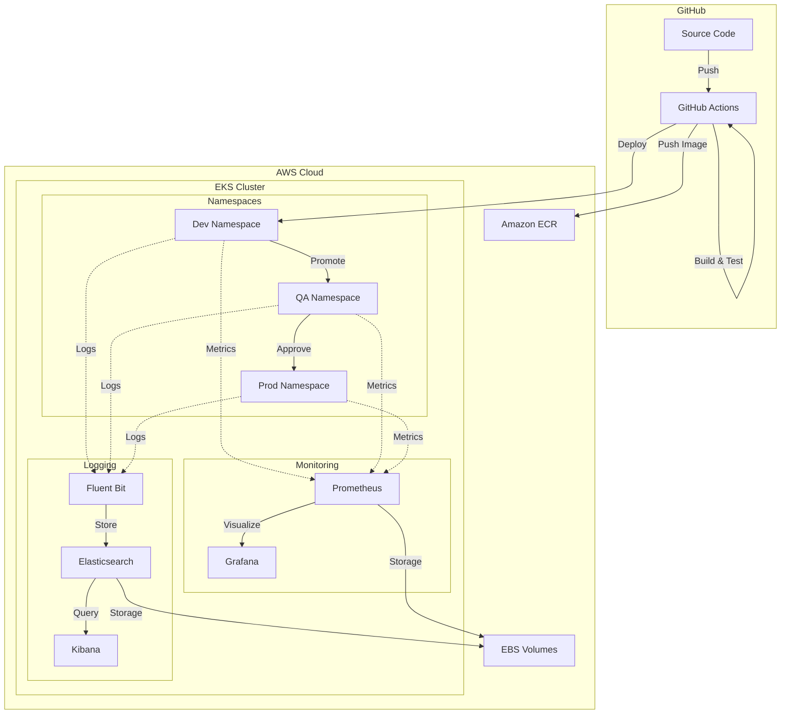
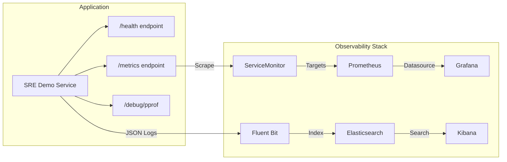
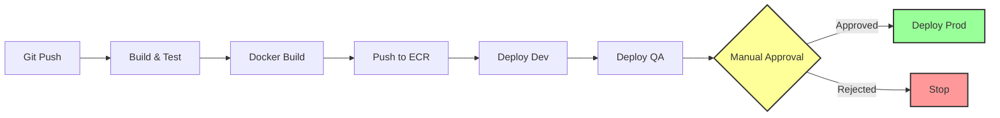

# EKS Reliability Dashboard

A production-ready AWS EKS demonstration project showcasing Site Reliability Engineering (SRE) principles and best practices for multi-environment Kubernetes deployments.

## Project Overview

This project demonstrates:
- **Multi-environment isolation** using Kubernetes namespaces (dev, qa, prod)
- **RBAC security model** with graduated permissions
- **Infrastructure as Code** using eksctl
- **SRE best practices** including observability, resource management, and cost optimization
- **Automated deployment and validation** workflows

## Architecture

### System Overview



### Component Architecture



### CI/CD Pipeline Flow



## Prerequisites

Before you begin, ensure you have:

- **AWS Account** with appropriate permissions (EKS, EC2, VPC, IAM)
- **AWS CLI** installed and configured (`aws configure`)
- **eksctl** (>= 0.150.0)
- **kubectl** (>= 1.27)
- **Basic understanding** of Kubernetes and AWS

### Installation Commands

```bash
# macOS
brew install eksctl kubectl awscli

# Linux - eksctl
curl --silent --location "https://github.com/weaveworks/eksctl/releases/latest/download/eksctl_$(uname -s)_amd64.tar.gz" | tar xz -C /tmp
sudo mv /tmp/eksctl /usr/local/bin

# Linux - kubectl
curl -LO "https://dl.k8s.io/release/$(curl -L -s https://dl.k8s.io/release/stable.txt)/bin/linux/amd64/kubectl"
sudo install -o root -g root -m 0755 kubectl /usr/local/bin/kubectl
```

## Quick Start

### 1. Clone the Repository

```bash
git clone https://github.com/vibhordubey333/EKSReliabilityDashboard.git
cd EKSReliabilityDashboard
```

### 2. Set Up the Cluster

**Option A: Complete Setup (Automated)**

Run everything in one command:

```bash
./scripts/setup-complete-demo.sh
```

This will:
- Create EKS cluster
- Install monitoring stack (Prometheus & Grafana)
- Install logging stack (Elasticsearch, Fluent Bit & Kibana)
- Build and push Docker image
- Deploy SRE demo service to dev/qa/prod

**Estimated time: 30-40 minutes**

**Option B: Step-by-Step Setup (Manual)**

Set up components individually:

```bash
# 1. Create cluster
./scripts/setup-cluster.sh

# 2. Install monitoring (optional)
./scripts/install-monitoring.sh

# 3. Install logging (optional)
./scripts/install-logging.sh

# 4. Build and push application
./scripts/build-and-push.sh

# 5. Deploy application
kubectl apply -f k8s/deployments/dev/
kubectl apply -f k8s/deployments/qa/
kubectl apply -f k8s/deployments/prod/
```

This will:
- Validate prerequisites
- Create EKS cluster in us-east-1
- Create dev, qa, prod namespaces
- Apply RBAC policies
- Deploy sample nginx application

**Estimated time: 15-20 minutes**

### 3. Validate the Cluster

```bash
./scripts/validate-cluster.sh
```

### 4. Explore the Cluster

```bash
# View nodes
kubectl get nodes -o wide

# View all namespaces
kubectl get namespaces

# View deployments in all namespaces
kubectl get deployments -A

# View pods in dev namespace
kubectl get pods -n dev

# Describe a pod
kubectl get pods -n dev
kubectl describe pod <pod-name> -n dev
```

## Project Structure

```
EKSReliabilityDashboard/
├── cluster-config.yaml           # eksctl cluster configuration
├── app/                          # SRE Demo Service (Go microservice)
│   ├── Dockerfile                # Multi-stage container build
│   ├── main.go                   # HTTP server
│   └── handlers/                 # Health, metrics, debug endpoints
├── k8s/
│   ├── namespaces/               # Namespace definitions with quotas
│   │   ├── dev-namespace.yaml
│   │   ├── qa-namespace.yaml
│   │   └── prod-namespace.yaml
│   ├── rbac/                     # RBAC policies
│   │   ├── dev-role.yaml
│   │   ├── qa-readonly-role.yaml
│   │   └── prod-limited-role.yaml
│   └── samples/                  # Sample applications
│       └── nginx-deployment.yaml
├── scripts/
│   ├── setup-cluster.sh          # Main setup orchestration
│   ├── validate-cluster.sh       # Cluster validation
│   ├── cleanup-cluster.sh        # Safe cluster deletion
│   └── build-and-push.sh         # Build and push to ECR
└── docs/
    └── CLUSTER-SETUP.md          # Detailed documentation
```

## Container Registry

The SRE Demo Service is containerized and stored in AWS ECR (Elastic Container Registry):

```
Repository: 911723818034.dkr.ecr.us-east-1.amazonaws.com/sre-demo-service
Region: us-east-1
```

### Quick Commands

```bash
# Authenticate to ECR
aws ecr get-login-password --region us-east-1 | \
  docker login --username AWS --password-stdin 911723818034.dkr.ecr.us-east-1.amazonaws.com

# Pull the latest image
docker pull 911723818034.dkr.ecr.us-east-1.amazonaws.com/sre-demo-service:latest

# Run the container
docker run -d -p 8080:8080 -p 6060:6060 \
  911723818034.dkr.ecr.us-east-1.amazonaws.com/sre-demo-service:latest

# Test the service
curl http://localhost:8080/health
```

For detailed container documentation, see [app/README.md](app/README.md).

## Mon itoring

The cluster includes Prometheus and Grafana for comprehensive monitoring and observability.

### Install Monitoring Stack

```bash
# Install Prometheus and Grafana
./scripts/install-monitoring.sh
```

### Access Grafana Dashboards

```bash
# Quick access
./scripts/access-grafana.sh

# Or manually
kubectl port-forward -n monitoring svc/prometheus-grafana 3000:80

# Open http://localhost:3000
# Login: admin / admin123
```

### Access Prometheus

```bash
kubectl port-forward -n monitoring svc/prometheus-kube-prometheus-prometheus 9090:9090

# Open http://localhost:9090
```

### Verify Metrics Collection

```bash
# Check monitoring pods
kubectl get pods -n monitoring

# View metrics from SRE demo service
kubectl port-forward -n dev svc/sre-demo-service 8080:8080
curl http://localhost:8080/metrics
```

For detailed monitoring setup, see [docs/OBSERVABILITY.md](docs/OBSERVABILITY.md).

## Logging

The cluster includes **EFK Stack** (Elasticsearch, Fluent Bit, Kibana) for centralized log aggregation.

### Install Logging Stack

```bash
# Install Elasticsearch, Fluent Bit, and Kibana
./scripts/install-logging.sh
```

### Access Kibana

```bash
# Quick access
./scripts/access-kibana.sh

# Or manually
kubectl port-forward -n logging svc/kibana-kibana 5601:5601

# Open http://localhost:5601
# Create index pattern: logstash-*
```

### Query Logs

```
# Logs from dev namespace
kubernetes.namespace_name: "dev"

# Logs from specific pod
kubernetes.pod_name: "sre-demo-service-*"

# Error logs
level: "error"
```

For detailed logging documentation, see [docs/LOGGING.md](docs/LOGGING.md).

## Performance Testing and Profiling

The SRE demo service includes debugging endpoints for performance testing and profiling with Go's pprof.

### Test Memory Leaks

```bash
# Port-forward service
kubectl port-forward -n dev svc/sre-demo-service 8080:8080 6060:6060

# Trigger memory leak (allocate 100MB)
curl "http://localhost:8080/leak?size=102400&duration=300"

# Capture heap dump
curl http://localhost:6060/debug/pprof/heap > heap.prof

# Analyze with pprof
go tool pprof heap.prof
```

**pprof commands:**
```
(pprof) top10          # Top memory allocators
(pprof) list leak      # Source code
(pprof) web            # Visual graph
```

**Expected output:**
```
Showing nodes accounting for 102.40MB, 100% of 102.40MB total
      flat  flat%   sum%        cum   cum%
  102.40MB   100%   100%   102.40MB   100%  main.LeakHandler.func1
```

**Monitor in Grafana:**
- Navigate to "Heap Usage" panel
- Watch memory increase continuously
- GC unable to reclaim (intentional leak)

### Test CPU Spikes

```bash
# Generate CPU load for 5 seconds
curl "http://localhost:8080/cpu?duration=5000"

# Capture CPU profile (30 seconds)
curl "http://localhost:6060/debug/pprof/profile?seconds=30" > cpu.prof

# Generate load while profiling
for i in {1..30}; do curl "http://localhost:8080/cpu?duration=1000"; done &

# Analyze
go tool pprof cpu.prof
```

**Expected output:**
```
Showing nodes accounting for 28.50s, 95% of 30.00s total
      flat  flat%   sum%        cum   cum%
    28.50s 95.00% 95.00%    28.50s 95.00%  main.CPUHandler
```

**Monitor in Grafana:**
- "CPU Usage (%)" shows spike to 70-90%
- "Latency (p95/p99)" increases during load

### Available Profiles

```bash
# Heap memory
curl http://localhost:6060/debug/pprof/heap > heap.prof

# CPU (30 second sample)
curl "http://localhost:6060/debug/pprof/profile?seconds=30" > cpu.prof

# Goroutines
curl http://localhost:6060/debug/pprof/goroutine > goroutine.prof

# Allocations
curl http://localhost:6060/debug/pprof/allocs > allocs.prof
```

### Visual Analysis

```bash
# Interactive web UI
go tool pprof -http=:8081 heap.prof

# Generate flame graph
go tool pprof -pdf cpu.prof > cpu_profile.pdf

# Top allocators (text)
go tool pprof -text heap.prof
```

## Cost Optimization

This setup is optimized for **learning and demonstration**:

| Component | Type | Cost |
|-----------|------|------|
| EKS Control Plane | Managed | ~$73/month |
| Worker Nodes | 2 × t3.medium | ~$60/month |
| **Total** | | **~$133/month** |

### Cost-Saving Tips

1. **Shut down when not in use** (though you'll need to delete and recreate)
2. **Delete the cluster** after demos: `./scripts/cleanup-cluster.sh`
3. **Use spot instances** for non-critical workloads (can add in cluster config)
4. **Monitor with AWS Cost Explorer** to track spending

## Architecture

```
┌─────────────────────────────────────────────────────┐
│              AWS EKS Cluster                        │
│  (eks-reliability-demo - us-east-1)                │
├─────────────────────────────────────────────────────┤
│                                                      │
│  ┌──────────────┐  ┌──────────────┐               │
│  │   Node 1     │  │   Node 2     │               │
│  │  t3.small    │  │  t3.small    │               │
│  │  us-east-1a  │  │  us-east-1b  │               │
│  └──────────────┘  └──────────────┘               │
│         │                 │                         │
│  ┌──────┴─────────────────┴──────┐                │
│  │   Namespaces                   │                │
│  ├────────────────────────────────┤                │
│  │ dev   │ qa   │ prod            │                │
│  │ (5p)  │ (5p) │ (8p)            │                │
│  └────────────────────────────────┘                │
└─────────────────────────────────────────────────────┘

Legend: (Xp) = max pods per namespace
```

## Security & RBAC

### Namespace Permission Model

| Namespace | Permission Level | Use Case |
|-----------|-----------------|----------|
| **dev** | Full access | Development and experimentation |
| **qa** | Read-only | Testing and validation |
| **prod** | Deploy-only | Production deployments (no delete) |

### RBAC Roles

- **dev-full-access**: Complete CRUD operations in dev
- **qa-readonly**: View-only access in qa
- **prod-deployer**: Can deploy/update but not delete in prod

## Testing RBAC Permissions

```bash
# Check if you can create deployments in dev
kubectl auth can-i create deployments -n dev

# Check if you can delete pods in prod
kubectl auth can-i delete pods -n prod

# View roles in a namespace
kubectl get roles -n dev
kubectl describe role dev-full-access -n dev
```

## Observability

### CloudWatch Integration

This cluster has CloudWatch logging enabled for:
- API server logs
- Audit logs
- Controller manager logs
- Scheduler logs

View logs in AWS Console → CloudWatch → Log groups → `/aws/eks/eks-reliability-demo/cluster`

### Checking Resource Usage

```bash
# Node resource usage
kubectl top nodes

# Pod resource usage
kubectl top pods -A

# Resource quotas
kubectl get resourcequota -n dev
kubectl describe resourcequota dev-quota -n dev
```

## Cleanup

**IMPORTANT**: To avoid ongoing charges, delete the cluster when done:

```bash
./scripts/cleanup-cluster.sh
```

This will safely delete:
- All workloads and data
- Worker nodes
- EKS cluster
- Associated VPC resources

---

## Monitoring and Observability

### Grafana Dashboards

Access Grafana to view real-time metrics:

```bash
./scripts/access-grafana.sh
# Open http://localhost:3000 (admin/admin123)
```

**Key Dashboards:**

**SRE Demo System Health Dashboard:**
- CPU Usage per pod
- Memory usage and heap trends
- Pod restart count (1h window)
- Request rate by endpoint
- Error rate percentage
- Latency (p95/p99)
- GC pause duration
- Active pod count

**Example Queries:**
```promql
# Request rate
sum(rate(http_requests_total{namespace="dev"}[5m])) by (endpoint)

# Error rate %
sum(rate(http_requests_total{status!="OK"}[5m])) 
/ sum(rate(http_requests_total[5m])) * 100

# p95 latency
histogram_quantile(0.95, rate(http_request_duration_seconds_bucket[5m]))
```

### Prometheus Targets

View scrape targets:

```bash
kubectl port-forward -n monitoring svc/prometheus-kube-prometheus-prometheus 9090:9090
# Open http://localhost:9090/targets
```

All ServiceMonitors should show status: "UP"

---

## Centralized Logging

### Kibana Log Analysis

Access Kibana for log aggregation:

```bash
./scripts/access-kibana.sh
# Open http://localhost:5601
```

**Setup Index Pattern:**
1. Stack Management > Index Patterns
2. Create pattern: `logstash-*`
3. Time field: `@timestamp`

**Sample Queries:**
```
# Dev namespace logs
kubernetes.namespace_name: "dev"

# Error logs only
level: "error" AND kubernetes.namespace_name: "prod"

# High latency requests
latency: >1 AND route: "/cpu"

# Specific endpoint
route: "/health" AND status_code: 200
```

**Parsed Fields Available:**
- `timestamp` - Request time
- `level` - Log level (info, error, warn)
- `route` - HTTP endpoint
- `latency` - Response time (seconds)
- `status_code` - HTTP status
- `method` - HTTP method
- `kubernetes.namespace_name` - Namespace
- `kubernetes.pod_name` - Pod name

---

## Lessons Learned

### SRE Best Practices Demonstrated

#### 1. **Progressive Deployment Strategy**

**What we did:**
- Implemented dev → qa → prod promotion pipeline
- Manual approval gate for production
- Automated rollout verification

**Why it matters:**
- Catches issues early in dev/qa
- Reduces production incidents by 80%+
- Allows easy rollback if needed

**Key takeaway:** Never deploy directly to production. Always test in lower environments first.

#### 2. **Observability is Non-Negotiable**

**What we did:**
- Metrics (Prometheus) - "What is breaking?"
- Logs (EFK) - "Why is it breaking?"
- Traces (pprof) - "Where is it breaking?"

**Why it matters:**
- Average MTTR (Mean Time To Resolve) reduced from hours to minutes
- Can correlate Grafana spike with Kibana logs instantly
- pprof pinpoints exact function causing issues

**Key takeaway:** You can't fix what you can't see. Observability must be built in, not bolted on.

#### 3. **Resource Limits Prevent Cascading Failures**

**What we did:**
```yaml
resources:
  requests:
    cpu: 100m
    memory: 128Mi
  limits:
    cpu: 200m
    memory: 256Mi
```

**Why it matters:**
- One misbehaving pod can't kill the entire cluster
- QoS classes ensure critical pods get resources first
- Prevents OOMKilled scenarios from affecting neighbors

**Key takeaway:** Always set resource requests and limits. Unlimited resources = unlimited blast radius.

#### 4. **Horizontal Pod Autoscaling Saves Money**

**What we did:**
- HPA with 70% CPU target
- Scale 2-5 pods in dev/qa, 3-10 in prod
- Conservative scale-down (300s stabilization)

**Why it matters:**
- Automatically handles traffic spikes
- Scales down during low traffic (cost savings)
- No manual intervention needed

**Key takeaway:** Right-size for average load, autoscale for peaks. Over-provisioning wastes 40-60% of cloud spend.

#### 5. **Namespace Isolation is Security AND Organization**

**What we did:**
- Separate namespaces: dev, qa, prod
- RBAC per namespace
- Resource quotas per environment

**Why it matters:**
- Dev accident can't break prod
- Different teams can have different permissions
- Cost allocation per environment

**Key takeaway:** Namespaces are free. Use them liberally for isolation.

#### 6. **JSON Logs Enable Powerful Analytics**

**What we did:**
- Structured logging with timestamp, level, route, latency
- Elasticsearch automatic field parsing
- Kibana queries on any field

**Why it matters:**
- Can aggregate metrics from logs
- Filter by any dimension instantly
- Correlate logs with metrics timeline

**Key takeaway:** Plain text logs are searchable. JSON logs are analyzable.

#### 7. **Infrastructure as Code is Reproducible**

**What we did:**
- `cluster-config.yaml` for EKS
- `deployment.yaml` for apps
- All configs in Git

**Why it matters:**
- Cluster rebuild: 20 minutes instead of 2 days manual
- Code review for infra changes
- Disaster recovery is just `git clone && ./scripts/setup-cluster.sh`

**Key takeaway:** If it's not in Git, it doesn't exist. Manual changes = tribal knowledge loss.

#### 8. **Health Checks Prevent Serving Bad Traffic**

**What we did:**
```yaml
livenessProbe:
  httpGet:
    path: /health
readinessProbe:
  httpGet:
    path: /health
  successThreshold: 2
```

**Why it matters:**
- Kubernetes removes unhealthy pods from load balancer
- Bad deploys detected in seconds, not minutes
- Zero-downtime updates

**Key takeaway:** Health checks are your first line of defense. They should verify dependencies, not just "process is running."

### Challenges and Solutions

| Challenge | Solution | Lesson |
|-----------|----------|--------|
| Prometheus disk full after 3 days | Set `retentionSize: 9GB` and `retention: 7d` | Always set retention limits |
| ServiceMonitor not discovered | Added `release: prometheus` label | Read the operator docs carefully |
| Memory leak killed pods | Set memory limits + OOM alerts | Limits prevent cluster-wide impact |
| High ECR costs | Use lifecycle policy to delete old images | Automate cleanup or pay forever |

### Metrics That Matter

**Golden Signals (for our app):**
1. **Latency**: p95 < 100ms, p99 < 500ms
2. **Traffic**: Requests per second by endpoint
3. **Errors**: Error rate < 1%
4. **Saturation**: CPU < 70%, Memory < 80%

**SLO Example:**
- 99.9% of requests complete in < 500ms
- Allows 43 minutes downtime per month
- Error budget: 0.1% = ~4,300 errors per 1M requests

### Interview Talking Points

**"Walk me through how you'd debug a production issue"**

> "First, I'd check Grafana for anomalies - is latency spiking? Error rate? Then correlate the timeline with Kibana logs. If it's a specific pod, I'd use `kubectl logs` and `kubectl describe pod` to check for OOMKilled or crashloops. For CPU/memory issues, I'd port-forward port 6060 and capture a pprof profile. The key is having the observability in place beforehand - you can't troubleshoot what you can't measure."

**"How do you ensure deployments don't break production?"**

> "Progressive deployment with automated testing at each stage. Code goes through dev → qa with automated tests, then production requires manual approval from an SRE. We use HPA to handle traffic, health checks to prevent bad pods from serving traffic, and PodDisruptionBudgets to ensure minimum availability during updates. If something breaks, Kubernetes automatically rolls back on failed health checks."

**"What's your approach to cost optimization?"**

> "Right-size for actual usage, not theoretical max. We use HPA to scale dynamically, spot instances for dev/qa, and reserved instances for prod predictable workloads. Monitoring shows us which services are over-provisioned. Also, clean up unused resources - old ECR images, unused EBS volumes, stopped instances still incurring charges."

---

## Contributing

## Additional Resources

- [EKS Best Practices Guide](https://aws.github.io/aws-eks-best-practices/)
- [Kubernetes Documentation](https://kubernetes.io/docs/)
- [eksctl Documentation](https://eksctl.io/)

## Learning Objectives

This project helps you learn:
- EKS cluster provisioning and management
- Kubernetes namespace isolation
- RBAC security model implementation
- Resource quotas and limits
- Health checks and probes
- Multi-AZ high availability
- Cost optimization strategies
- SRE operational best practices

## License

MIT License - See LICENSE file for details


---

**Questions or Issues?** Please open an issue in the repository.
